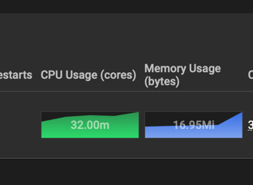
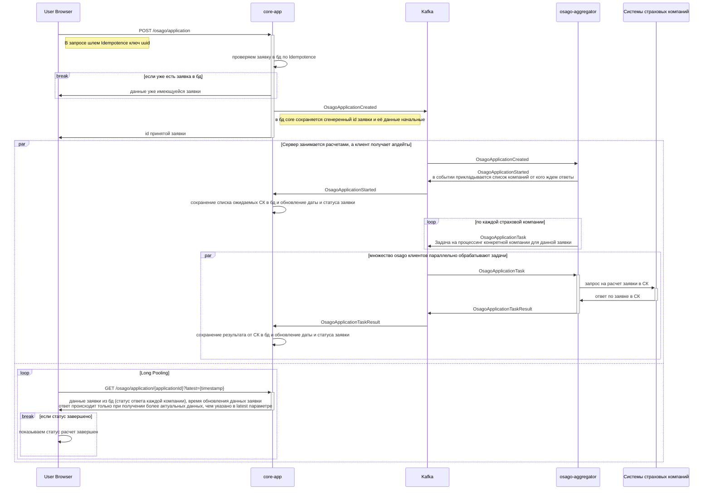

# Задание 1 - Проектирование технологической архитектуры

## Текущие проблемы

> Сайт медленно загружает страницы. Когда нагрузка на приложение повышается, пользователи массово жалуются на то, что
> страницы грузятся по несколько минут или не загружаются вообще. При этом максимально зафиксированная нагрузка на
> запросы поиска составила 50 RPS, а на запросы оформления — 10 RPS. Такое положение дел плохо влияет на показатели NPS
> и retention.

Стоит поставить мониторинг для анализа где находится проблема, а также внедрить трейсинг. Возможно уже после добавления
мониторинга будет видно что всё упирается в базу данных и нужно разгружать именно её. Для этого может подойти
горизонтальное масштабирование нод с базой данных, а также нужно добавить репликацию, чтобы несколько хостов могли
обрабатывать запросы поиска и распределяли нагрузку.
Возможно что нагрузка не только в бд упирается, но и в логику - тогда там логичнее горизонтальное масштабирование (если
ресурсы уже адекватные выделены, если нет и всё упираетяс в ресурсы - можно дать больше ресурсов тоже).

> Нарушается SLA для B2B-клиентов. Менеджеры уже неоднократно получали сообщения от партнёров, что SLA API не
> соответствует заявленному. В ходе изучения таких инцидентов выяснилось, что в эти периоды количество запросов от
> одного из партнёров кратно возрастало. Оно достигало суммарно 250 RPS на все вызываемые операции. По сути, один из
> партнёров «сжирал» все ресурсы приложения. С этим партнёром изначально договорились, что нагрузка не будет превышать
> 20 RPS.

Явно видно что нужно настроить Rate Limit, чтобы у каждого из пользователей API было свое ограничение. Разделять можем
по API Key, который у каждого партнёра свой и в одном экземпляре (я полагаю).
Также можно сделать выделенные дополнительные инстансы которые будут обрабатывать именно B2B клиентов (а в избранных
случаях можно даже конкретного клиента на выделенные ресурсы выделить). Таким образом деградация производительности
из-за высокой нагрузки у одного клиента будет меньше влиять на других (но из-за наличия единой базы данных всего
продукта - всё равно влияние может оказываться, поэтому rate limit критичен).
Например, для этого высоконагруженного B2B клиента можно подписать дополнительный договор на расширение допустимого
RPS - вместо стандартных 20 - 100, но за допденьги. На эти допденьги и поднимаем выделенные сервисы под него,
настраиваем чтобы API Key его приводил на выделенные сервисы (либо вообще отдельный домен под него даем).

> Приложение падает. InsureTech несколько раз столкнулась с проблемой недоступности приложения. Команда реагировала на
> проблему очень медленно, поскольку узнавала о ней от пользователей. Каждый час простоя сервис несёт финансовые
> убытки — примерно 500 тысяч рублей. Также бизнес несёт репутационные потери: в СМИ выходят негативные публикации, у
> сервиса низкие показатели удовлетворённости пользователей, а некоторые партнёры уже заявили о нежелании продлевать
> сотрудничество.

Во первых - недоступность мы должны узнавать первые, а не от пользователей. Еще одна причина поднять мониторинг, и
настроить алерты.
Во вторых нужно добавить репликацию инфраструктуры - система должна быть развернута в нескольких экземплярах, с
репликацией баз данных. Если какая-то часть системы упала - другой экземпляр должен перехватить трафик на себя.
В третьих - вероятно что часть недоступности приложения связана с ошибками при обновлениях. Нужно чтобы деплой
происходил постепенно, например через стратегию красный/синий - поднимать в дополнение к текущей версии сервисов новую,
часть трафика переводить на новую. И постепенно, при корректной доступности новой версии, увеличивать объем трафика на
новую. Чтобы если новая версия упадет - использовать старую сразу.
Однако это несет дополнительную нагрузку на работу с бд - мы не можем делать миграции предполагающие невозможность
работы старой версии бекенда, нужно обеспечивать корректную работу старой и новой версии одновременно, без критичных
ошибок.

## Планы

> InureTech планирует в ближайшее время провести большую рекламную кампанию. Ожидается существенный прирост
> пользователей.

Нужна механика автоматического масштабирования, так как рекламная кампания даст волнообразный рост. Система должна
автоматически усилиться и автоматически ужаться после завершения наплыва.

> Компания хочет сделать упор на развитие в регионах РФ.

Может быть полезно разделение инфраструктуры по разным регионам.
Чтобы сервисы (важно чтобы были stateless) были доступны ближе к пользователям
и снимали на себя часть нагрузки, а база данных реплицировалась.

Например несколько нод кубера в московской зоне, далее еще в центральной части России
и в восточной (вообще в идеале наверное стоит смотреть по географии пользовательской базы и насыщенности в разных
частях)

> Планируется значительный рост количества пользователей и запросов.

Нужен запас мощности, на текущих нагрузках система должна быть сильно расслаблена.
Либо же (лучше) иметь автоматические механизмы масштабирования (лучше горизонтального, если архитектура приложения
позволит).

Также нужно провести нагрузочное тестирование. Составить профиль нагрузки текущей, а далее масштабировать в разы.

По хорошему нужно нагрузочным тестированием понять границу способностей инфраструктуры сейчас - сколько пользователей мы
выдержим.

> Нужно обеспечить бесперебойную работу сервиса 24/7, при этом сервис должен обслуживать клиентов из всех часовых
> поясов.

Раз мы должны работать для всех часовых поясов, значит видимо времени когда пользователей нет в системе - не будет.
А бесперебойная работа 24/7 предполагает использование failover стратегий - даже если железо сломается либо датацентр
обесточится всё равно система должна работать. И при обновлении версии приложения также система должна работать,
постепенно обновляясь.

Реплицирование всей системы по разным географическим зонам поможет и для данного требования - если в одной зоне
происходит проблема, то трафик автоматически перенаправим на другую, рабочую зону, пусть даже она дальше от
пользователя.

> Требования к отказоустойчивости системы крайне высокие: RTO — 45 мин., RPO — 15 мин. Согласно требованиям бизнеса,
> доступность приложения должна быть равна 99,9%.

Если система стала недоступна - есть 45 мин на восстановление.

Если данные будут утеряны - максимально допустимая потеря - последние 15 минут.

Доступность приложения 99,9% означает 8,76 ч в год или 43,2 мин в месяц или 10,1 мин в неделю.

То есть в принципе, быстрые деплои с остановкой системы, длящиеся пару минут, и выполняемые раз в одну/две недели в
целом влезут в требования. НО если произойдет нештатная ситуация то из-за такого подхода к деплоям часть допустимого
времени уже будет потрачена.

> Дополнительно к этому нужно обеспечить одинаковое время загрузки страниц для пользователей из разных регионов. Оно не
> должно зависеть от географического местоположения пользователя.

Еще одна причина по которой стоит разнести систему на разные географические зоны, с реплицированием данных.

> Общий объём данных, которые хранятся в системе, равен 50 GB.

Объем данных небольшой, скорее всего и скорость увеличения объемов не сильно большая, а значит репликация скорее всего
будет работать довольно быстро.

## Задача

> Рассмотрите вертикальное и горизонтальное масштабирование для вашей системы.

Вертикальное масштабирование имеет смысл применять для машин где находятся базы данных - когда базам данных нехватает
ресурсов, тогда имеет смысл усилить сами машины.

В случае же самих сервисов с логикой - их масштабировать нужно горизонтально. судя по схеме нельзя строго утверждать что
все сервисы stateless, как и нельзя утверждать что они stateful. Однако скорее всего эти сервисы не хранят стейт,
который бы мешал их масштабировать горизонтально.

> Требуется ли использование дополнительных зон безопасности?

Да, системе нельзя оставаться в одном ЦОД, также как и в одном городе - нужно расположить в нескольких географических
зонах, с полной репликацией. В нормальном состоянии система будет таким образом распределять нагрузку, обеспечивать
более быстрый доступ пользователей к системе (за счет физически более близкого расположения и более низкой нагрузки), но
в случаях аварий такое распределение позволит остаться доступным.

Это позволит справиться с рисками "сгорел датацентр", "отключили электричество", "конкретно ваш сервер сдох".

> Проработайте конфигурацию развёртывания приложения в Kubernetes. Вы будете использовать независимые кластеры в каждой
> площадке или один растянутый? Оставьте на схеме комментарий с объяснением, почему вы выбрали тот или другой подход.

Kubernetes кластер проекта для начала достаточно сделать растянутым на несколько зон доступности. Это повысит надежность
и доступность системы, но добавит меньше сложностей чем при нескольких кластерах. Наша задача повысить доступность, а не
создать изоляцию кластеров. В каждой зоне доступности будет своя реплика бд, свои сервисы апи. А если возникнут проблемы
в одной из зон - трафик автоматически перейдет на другие зоны.

> Спланируйте балансировку нагрузки. Опишите подход к балансировке нагрузки, который обеспечит распределение трафика
> между вашими сервисами и географически распредёленными серверами.

Так как нам нужно чтобы пользователи из разных регионов страны попадали на наиболее близкий для них сервер, а также при
недоступности близкого сервера - переключаться на другой, нужно воспользоваться Global Server Load Balancer.
С его помощью будет учитываться и географическое положение пользователя и текущая доступность сервисов.
В кластере должны быть в каждой зоне доступности load balancer'ы этой зоны, а вне кластера должен быть настроен GSLB,
который будет узнавать доступность load balancer'а (и сервисов за ним).

Получается должна быть следующая цепочка health check:
GSLB -> Kubernetes Load Balancer (в каждой зоне доступности свой) -> сервисы в зоне доступности.
Если в зоне доступности все сервисы, нужные нам, окажутся нездоровы, то KLB сообщит что он тоже нездоров, тогда GSLB
перенаправит трафик до другой, здоровой зоны доступности.

> Определите наиболее подходящую фейловер-стратегию. Она должна отвечать заданным требованиям отказоустойчивости.

В нашем случае лучше подойдет стратегия Active-Active, так как нам нужно помимо обеспечения отказоустойчивости
обеспечить одинаковое время загрузки для пользователей из разных регионов - нужно одновременное присутствие в разных
зонах доступности.
Также такая схема позволит свести к минимуму время недоступности при отказах - не потребуется ожидать поднятие новых
инстансов когда уже нет рабочих.

> Определите конфигурацию базы данных. Учитывая требования RTO и RPO, спроектируйте конфигурацию базы данных:
> определите, как вы будете обеспечивать репликацию данных и их резервное копирование. Если будете использовать
> конкретный фреймворк конфигурации кластера БД, отразите его на схеме.

Для репликации, failover и бекапирования базы данных будем использовать Crunchy Postgres Operator - готовое решение для
кластера бд в Kubernetes. С его помощью сможем получить высокую отказоустойчивость, автоматические бекапы (с сохранением
в S3 хранилище например) и автоматический failover. Для репликации есть возможность выбрать синхронный и асинхронный тип
репликации. Если для бизнеса допустимо что разные ноды бд будут иметь небольшой рассинхрон, то можно будет полставить
асинхронный режим (по текущему описанию задачи недостаточно информации для решения).

> Определите, будете ли вы применять шардирование БД. Отразите своё решение на схеме.

Шардирование применяться не будет, так как данных не так уж много - база данных на 50 гигабайт суммарно. Также при
шардировании мы можем остаться без части данных, если произойдет отказ всех нод отдельного шарда. Применить шардирование
будет иметь смысл если данных будет много и будет критерий по которому удастся разделить их для эффективной работы.

## Схема

[InsureTech_технологическая_архитектура-to-be.drawio](Exc1/InsureTech_технологическая_архитектура-to-be.drawio.xml)

# Задание 2 - Динамическое масштабирование контейнеров

Применяем конфиги кубера:

```shell
kubectl apply -f deployment.yml
kubectl apply -f service.yml
kubectl apply -f autoscale.yml
```

Получаем адрес куда цепляться:

```shell
minikube service scaletestapp-service --url 
```

Так как запущен minikube с docker драйвером - выданный адрес будет работать пока не закроем терминал с этой командой.

Далее запускаем тест нагрузки, в папке `Exc2/locust`:

```shell
./run-locust.sh
```

Открываем http://localhost:8089 вводим 3000 юзеров, скорость увеличения 30, адрес - http://host.docker.internal:64132 (
либо другой порт, который указан в адресе из предыдущей команды от сервиса).

Также открываем дашборд смотрим какая там нагрузка по метрикам:

```shell
minikube dashboard
```

В разделе Pods видим использование памяти.


Результаты автоскейлинга доступны в [RESULTS.md](Exc2/RESULTS.md)

# Задание 3 - Переход на Event-Driven архитектуру

Анализ текущей архитектуры доступен в [документе](Exc3/ANALYZE.md).

Обновленная диаграмма - [файл](Exc3/InsureTech_C4_%D1%81ontainer-diagram-to-be.drawio.xml).

# Задание 4 - Проектирование продажи ОСАГО

Для работы с сервисом `osago-aggregator` будем использовать асинхронное взаимодействие.

Общий процесс будет выглядеть следующим образом:



Пояснения:

1. Событие `OsagoApplicationCreated` означает что появилась новая заявка и её нужно взять в расчет.
2. Событие `OsagoApplicationStarted` означает что расчет запущен, в событии сообщается полный список СК, от которых мы
   будем ждать ответов. За счет знания полного списка `core` сможет понимать ждать ли еще новые ответы, или уже все
   пришли.
3. Событие `OsagoApplicationTask` является триггером к запуску обсчета конкретной заявки в конкретной СК. За счет этого
   события мы получаем преимущество в обработке при наличии множества экземпляров `osago-aggregator` - они параллельно
   опросят все нужные нам СК.
4. Событие `OsagoApplicationTaskResult` передает результаты обсчета конкретной СК. Получает его `core-app` и обновляет
   статус заявки (если все СК уже выдали результаты) и время обновления (чтобы Long Pooling запросы на него завязать).
5. В случае если СК выдает ошибку - `osago-aggregator` вместо `OsagoApplicationTaskResult` сначала пробует повтор через
   публикацию повторно `OsagoApplicationTask`, но уже с данными `retryCounter`. Если же это уже 3 попытка - значит
   выдаем `OsagoApplicationTaskResult` с результатом "ошибка", чтобы отобразить что ответ от данной СК мы не получили.
   Ну и в мониторинг кидаем инфу конечно.
6. За счет Indempotence ключа мы не будем вести обсчет одной и той же заявки дважды, если вдруг у клиента лагнет
   интернет.
7. За счет `Long Pooling` мы получим внешне для пользователя "реалтайм", но в разработке будет попроще (тут websocket'ы
   особо смысла не вижу использовать - период опроса очень короткий).
8. Чтобы исключить ситуацию что `osago-aggregator` получил задачу (`OsagoApplicationTask`), но после этого
   перезагрузился или еще что-то случилось, из-за чего прервалось выполнение и заявка зависла навсегда - мы будем
   сохранять полученные задачи на обсчет в базе данных `osago-aggregator`. И будет механизм, который будет проверять нет
   ли забытых задач. Например, будет происходить проверка каждую минуту, что нет задач которые не меняли свой статус
   больше 2 минут (мы знаем что 1 минута таймаут работы с СК, а значит в течении 2 минут точно при корректно работе
   задача будет обновлена. если не обновилась - видимо экземпляр который задачу обрабатывал упал).
9. При обработке задачи `OsagoApplicationTask` обращение к СК делаем с указанием таймаута в 60 секунд, таким образом
   зависание СК нас не заденет - зафиксируем что СК недоступно и всё. Ну и в мониторинг конечно кинем.
10. На уровне взаимодействия с пользователем нужно поставить `Rate Limiting` чтобы заявки на обсчет не отправлялись
    слишком часто - например, даем 1 заявку в минуту на конкретного пользователя. Чтобы самим не столкнуться с отказом
    API страховых компаний (уже для всех наших юзеров).

Доработанная [диаграмма](Exc4/InsureTech_C4_%D1%81ontainer-diagram-to-be-exc4.drawio.xml).

# Задание 5 - Проектирование GraphQL API

На основании REST API у нас будут следующие сущности:

1. Client — основные данные клиента.
2. Document — документы клиента.
3. Relative — описание родственников клиента.

Схема [schema.graphql](Exc5/schema.graphql)

## Сравнение

Приведу пример использования REST и GraphQL для одного и того же сценария, чтобы показать, как GraphQL помогает избежать
перегрузки и сокращает объем передаваемых данных.

Например веб-приложение для отображения карточки клиента требует базовую информацию о клиенте (ID, имя), а также его
документы. Однако данные о родственниках ему не нужны, поэтому их загружать не требуется.

### Запрос с REST API

Для получения данных с REST API, согласно предоставленному контракту, нам нужно сделать два отдельных запроса:

`GET /clients/{id}`:

```
{
"id": "123",
"name": "John Doe",
"age": 30
}
```

`GET /clients/{id}/documents`:

```
[
  {
    "id": "1",
    "type": "passport",
    "number": "123456789",
    "issueDate": "2020-01-01",
    "expiryDate": "2030-01-01"
  },
  {
    "id": "2",
    "type": "driver_license",
    "number": "987654321",
    "issueDate": "2018-06-15",
    "expiryDate": "2028-06-15"
  }
]
```

Мы получаем лишние данные и делаем два запроса.

### Запрос с GraphQL API

```graphql
query {
    client(id: "123") {
        id
        name
        documents {
            id
            type
            number
        }
    }
}
```

Ответ:

```json
{
  "data": {
    "client": {
      "id": "123",
      "name": "John Doe",
      "documents": [
        {
          "id": "1",
          "type": "passport",
          "number": "123456789"
        },
        {
          "id": "2",
          "type": "driver_license",
          "number": "987654321"
        }
      ]
    }
  }
}
```

Получаем данные одним запросом, только те что нужны нам.

# Задание 6 - Настройка Rate Limiting


# Заметки

## minikube на apple silicon

Установить можно с homebrew. А запускать важно с указанием драйвера docker.

```shell
minikube start --vm-driver=docker
```

Проверяем что всё успешно запустилось:

```shell
minikube status
```

В ответ выведет:

```shell
minikube
type: Control Plane
host: Running
kubelet: Running
apiserver: Running
kubeconfig: Configured
```

Далее включаем metrics-server:

```shell
minikube addons enable metrics-server
```

Проверяем корректность работы через kubectl:

```shell
kubectl top node
```

Если аддон запустился корректно - будет выведена информация:

```shell
NAME       CPU(cores)   CPU%   MEMORY(bytes)   MEMORY%   
minikube   393m         7%     544Mi           6%  
```

Если говорит что metrics-server недоступен - нужно подождать пока поднимутся поды метрики.

## Kubernetes в IDEA Ultimate

В IDE [встроена](https://www.jetbrains.com/help/idea/kubernetes.html) поддержка работы с Kubernetes.

Можно там смотреть какие есть поды, на каких нодах и прочее.
